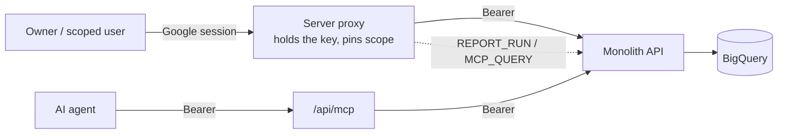

<h1 align="center"> Monolith — Every App's Data, One Place to Ask </h1>
<h1 align="center">

  <br>
  <div>
    <a href="https://github.com/fal3n-4ngel/monolith-dashboard/issues">
        
    </a>
    <a href="https://github.com/fal3n-4ngel/monolith-dashboard/stargazers">
        
    </a>
    <a href="https://github.com/fal3n-4ngel/monolith-dashboard">
        
    </a>
    <a href="https://github.com/fal3n-4ngel/monolith-dashboard/blob/main/LICENSE">
        
    </a>
    <br>
    </div>

   </h1>

## What is Monolith?

Monolith is the front door to [Monolith API](https://github.com/fal3n-4ngel/Monolith-API)'s BigQuery warehouse — the audit trail behind [Continuum Home](https://github.com/fal3n-4ngel/Continuum-Home) and every app that streams events through it. It does three things:

- **Documentation portal** at [`/docs`](app/docs/page.tsx) — MCP integration, app onboarding, the postback contract, auth, and the BigQuery schema, with sidebar navigation and prev/next paging.
- **Model Context Protocol server** at `/api/mcp` — so an AI coding agent can query audit telemetry and the schema from inside the editor.
- **Reporting workspace** at [`/audit`](app/audit/page.tsx) and [`/reports`](app/reports/page.tsx) — browse domain-event history and run the admin-authored reports, download as CSV. Gated behind Google sign-in; a solo owner by default, or many identities each seeing only their own app.

Live at **[monolith.adithyakrishnan.com](https://monolith.adithyakrishnan.com)**. It does **not** ingest events itself — that is Monolith API.

## Technical Details

```
Framework:  Next.js 16 (App Router, Turbopack) + React 19 + TypeScript
Styling:    Tailwind CSS v4
Auth:       NextAuth v5 — Google Sign-In, restricted to registered identities
MCP:        mcp-handler over standard HTTP transport, Bearer-authenticated
Hosting:    Vercel — monolith.adithyakrishnan.com
```

## Features

- **Server-side proxies.** The browser never holds a Monolith key — [`/api/audit/logs`](app/api/audit/logs/route.ts) and [`/api/reports`](app/api/reports/route.ts) hold it and forward to Monolith API on the signed-in user's behalf.
- **Per-identity scoping.** `DASHBOARD_CLIENTS` maps an email to `{ scope, key }`. A scoped user sees only their app; the proxy pins `sourceApp` / `callerApp` on every request, and the key it presents is itself bound to that app upstream.
- **Reports UI.** Typed inputs, sensible defaults, a client picker restricted to the apps a report applies to, a `General` / per-app tab split, and a one-click CSV download.
- **Its own telemetry.** The dashboard postbacks `REPORT_RUN` and `MCP_QUERY` events back to Monolith API as `sourceApp: monolith-dashboard`, so its usage shows up in the same reports.
- **Multi-user MCP.** `/api/mcp` registers per-user bearer keys and an owner fallback. Data tools run as the caller's *own* Monolith credential — an admin key reaches every app, any other identity is resolved through `DASHBOARD_CLIENTS` and pinned to its app, and an unmapped identity is refused. Plus an in-memory per-instance rate limit.

## Project Structure

```
app/
├── audit/            # Audit-log workspace (ProtectedRoute)
├── reports/          # Reports workspace (ProtectedRoute)
├── docs/             # Documentation portal
├── api/
│   ├── audit/logs/   # Server proxy → Monolith API GET /api/v1/audit/logs
│   ├── reports/      # Server proxies → GET /api/v1/reports + /{id}/run
│   ├── mcp/          # Model Context Protocol server
│   └── auth/         # NextAuth handlers
components/           # AuditStreamDashboard, ReportsWorkspace, WorkspaceHeader, landing
lib/
├── nextauth.ts       # Google auth, sign-in gated to registered identities
├── dashboard-clients.ts  # email → { scope, key }
├── postback.ts       # fire-and-forget usage telemetry to Monolith API
└── mcp/              # MCP auth, rate limit, and audit tools
```

## Architecture

Every signed-in caller ends up with a NextAuth session, and every data request goes through a same-origin proxy route — the Monolith API key stays on the server. The proxy resolves the session to a registered client, forwards the request with that client's bearer, and forces the app scope so a scoped user can only ever pull their own rows. AI agents take the other door: `/api/mcp`, bearer-authenticated, calling the same read endpoints under the same per-identity scoping — the token maps to a registered credential and its calls run pinned to that app. Report runs and MCP queries are postbacked to Monolith API so the dashboard's own usage lands in the warehouse alongside everything else.



Reference docs — MCP setup, onboarding, the postback contract, the report catalog — live at **[monolith.adithyakrishnan.com](https://monolith.adithyakrishnan.com)**.

## Run Locally

### Clone & install

```bash
git clone https://github.com/fal3n-4ngel/monolith-dashboard.git
cd monolith-dashboard
npm install
```

### Configure

Create `.env.local` (git-ignored) with the Google OAuth credentials (`AUTH_GOOGLE_ID`, `AUTH_GOOGLE_SECRET`, `AUTH_SECRET`), the allow-listed identity (`ALLOWED_EMAIL`), and a Monolith API key (`MONOLITH_API_KEY`). To point the proxies at a local Monolith API instead of production:

```env
MONOLITH_API_URL=http://localhost:8080
```

The full variable list — including `DASHBOARD_CLIENTS` for multi-tenant setups — is on the docs site.

### Develop

```bash
npm run dev
```

Open [http://localhost:3000](http://localhost:3000). `/audit` and `/reports` need a running Monolith API; the landing page and `/docs` do not.

### Production build

```bash
npm run build
npm run start
```

## Security Model

- **The key never reaches the browser.** All data flows through same-origin proxy routes that attach the Bearer server-side.
- **Sign-in is gated.** Only emails in `DASHBOARD_CLIENTS` (or the `ALLOWED_EMAIL` solo-owner fallback) get a session; the proxy re-checks on every request.
- **Scope is enforced twice.** The proxy pins `sourceApp` per session, *and* the key it presents is bound to that app in Monolith API — a bug in one layer can't leak another client's data.
- **MCP is bearer-only** and rate limited per credential. Its data tools go through the same per-identity resolution as the web proxies: a registered token maps to a `DASHBOARD_CLIENTS` credential and is pinned to that app; only an admin identity reads cross-app; an unmapped token is refused rather than handed a shared key.

# Contributors

<table>
<tr>
    <td align="center">
        <a href="https://github.com/fal3n-4ngel">
            
            <br />
            <sub><b>Adithya Krishnan</b></sub>
        </a>
    </td>
   </tr>
</table>

## License

Open-source under the [MIT License](LICENSE). Contribution conventions are in [CONTRIBUTING.md](CONTRIBUTING.md).

---

## 📝 Authors' Note

> Monolith API was headless for a while — postbacks in, BigQuery rows out, and a SQL console when I actually wanted to look at something. This is the part where looking at it stopped being a chore.
>
> The docs and the MCP server came first, then the audit view, then reports once I got tired of writing the same `GROUP BY` by hand. The multi-tenant bits exist so I can give someone a link to their own numbers without giving them the warehouse.

<a href="https://www.buymeacoffee.com/fal3n-4ngel" target="_blank"></a>
